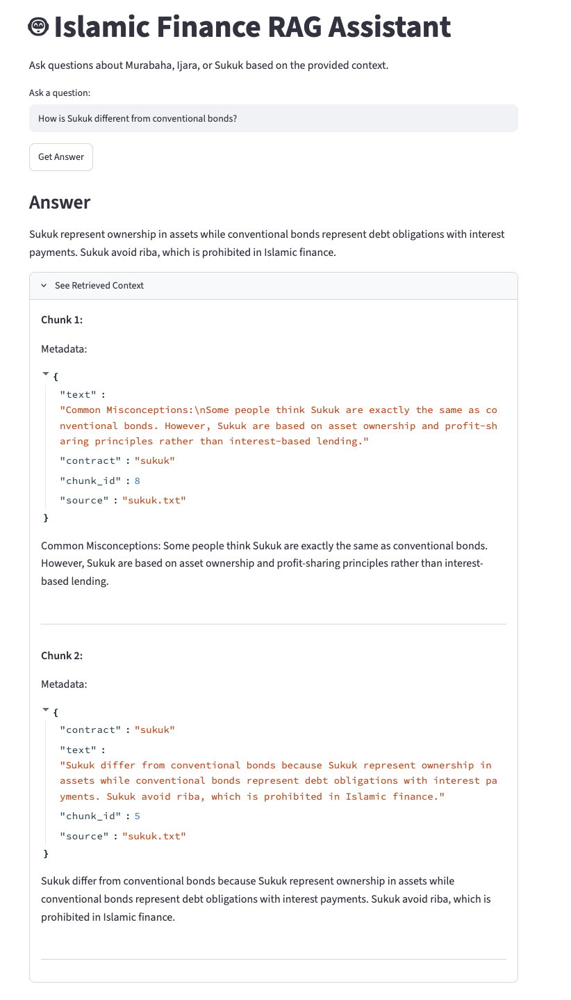
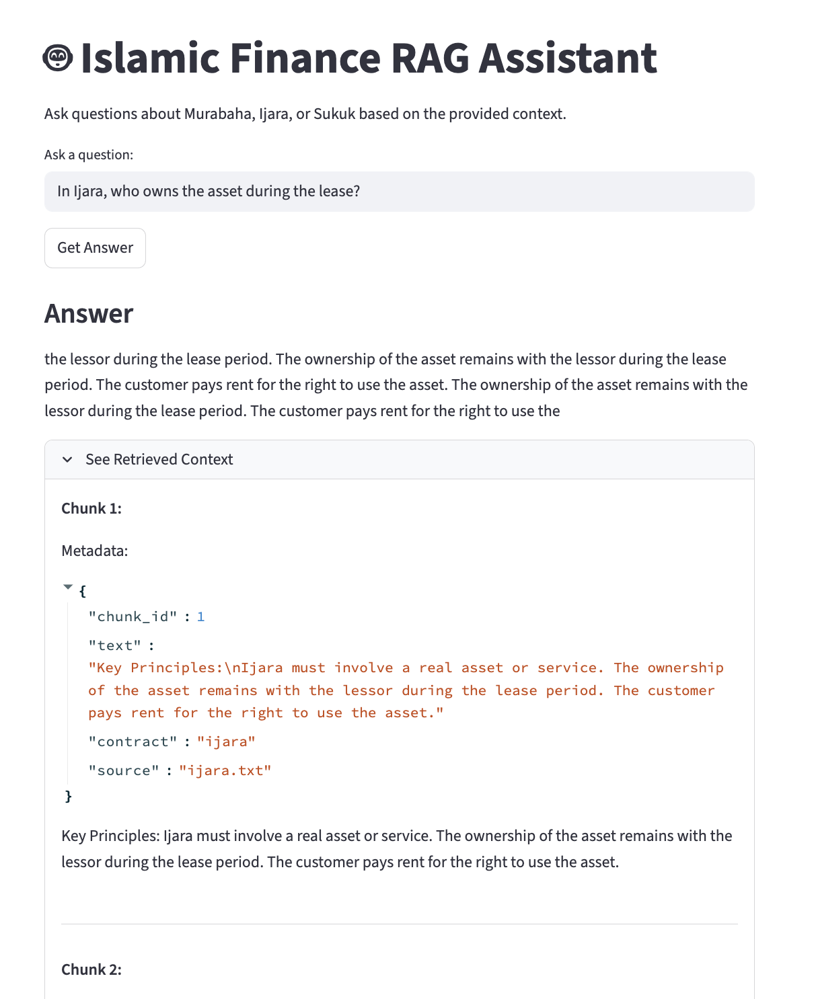
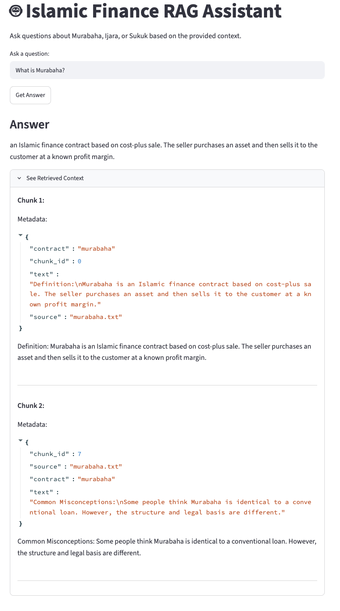

# Islamic Finance RAG Assistant

A Retrieval-Augmented Generation (RAG) assistant that answers questions about Murabaha, Ijara, and Sukuk using document-grounded retrieval.

## Project Goal

This project was built as part of my journey to learn Retrieval-Augmented Generation (RAG) and apply it to the domain of Islamic finance. The focus was on understanding the complete RAG pipeline—from document chunking and embeddings to retrieval, prompt engineering, evaluation, and a simple Streamlit interface.

The project demonstrates how a domain-specific RAG system can retrieve relevant information from a curated Islamic finance knowledge base and generate grounded responses using only the retrieved context.

## Features

- Loads Islamic finance documents
- Splits documents into semantic chunks
- Creates embeddings using SentenceTransformers
- Stores vectors in ChromaDB
- Uses metadata filtering
- Retrieves relevant context
- Generates answers using FLAN-T5
- Displays retrieved context and metadata

## Tech Stack

- Python
- Streamlit
- ChromaDB
- SentenceTransformers
- Hugging Face Transformers

## Project Structure

```text
islamic-finance-rag-assistant/
├── app.py
├── ingest.py
├── retriever.py
├── generator.py
├── test_cases.py
│
├── data/
│   ├── murabaha.txt
│   ├── ijara.txt
│   └── sukuk.txt
├── screenshots/
│   ├── murabaha.png
│   ├── ijara.png
│   └── sukuk.png
├── .gitignore
├── README.md
└── requirements.txt
```

## Installation

```bash
pip install -r requirements.txt
```

## How to Run

```bash
streamlit run app.py
```

## Example Questions

- In Murabaha, must the seller own the asset before selling?
- In Ijara, who owns the asset during the lease?
- How is Sukuk different from conventional bonds?

## Screenshots

### Home


### Sukuk Question


### Ijara Question


### Murabaha Question



## What I Learned

This project helped me understand:

- Document chunking
- Embeddings
- Vector databases
- Semantic retrieval
- Metadata filtering
- Prompt engineering
- Evaluation
- Streamlit integration

## Challenges and Lessons Learned

During development I discovered that:

- Chunk size significantly affects retrieval quality.
- Metadata filtering reduced cross-contract retrieval (Murabaha vs Ijara).
- FLAN-T5 sometimes produced weak answers despite correct retrieval, showing that retrieval quality and generation quality are separate problems.
- Displaying retrieved context made debugging much easier and improved transparency.

## Future Improvements

- Load the language model only once at startup
- Add support for PDF ingestion
- Improve answer generation with a stronger LLM
- Add automated evaluation metrics
